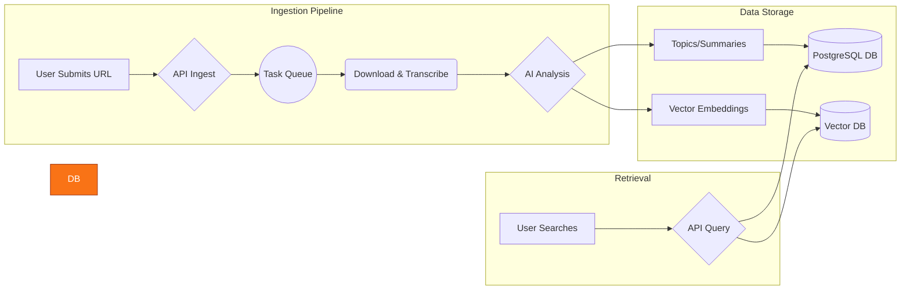

# Citeio

**An intelligent media analysis platform that transforms long-form video and audio content into a structured, searchable, and queryable knowledge base.**

 

  

---

## ► About The Project

Citeio is a full-stack application designed to ingest, analyze, and index media content. It tackles the problem of "information overload" in video and podcasts by automatically breaking down long-form content into distinct topics, summarizing them, and making the entire library semantically searchable. This allows users to find the exact moment a topic is discussed without scrubbing through hours of footage.

 

## ► Core Features

* **🎙️ Automated Media Ingestion & Transcription:**
    * Downloads media from external sources (e.g., YouTube).
    * Standardizes content to an optimal audio format.
    * Generates a detailed, time-coded transcript.

* **🧠 AI-Powered Content Analysis:**
    * Uses advanced language models to identify and extract distinct thematic topics.
    * Generates concise summaries for both the entire media file and each individual topic.

* **🔍 Powerful Semantic Search:**
    * Generates vector embeddings for all content, capturing its semantic meaning.
    * Allows users to search based on concepts and ideas, not just keywords, and get back precise, timestamped results.

* **⚙️ RESTful API:**
    * Exposes all functionality through a comprehensive API, allowing for easy integration with other services or client applications.

 

## ► Architecture & Workflow

The application follows a sophisticated, automated pipeline from media ingestion to final output. The architecture is designed for scalability and efficient processing.

 

## ► Tech Stack

This project leverages a modern, robust tech stack to handle its various components.

| Category       | Technologies                                      |
| -------------- | ------------------------------------------------- |
| **Frontend** | `Next.js`, `React`, `TypeScript`, `Tailwind CSS`  |
| **Backend** | `Python`, `FastAPI`, `Celery`, `Redis`            |
| **AI / ML** | `LangChain`, `OpenAI API`, `SentenceTransformers` |
| **Database** | `PostgreSQL` (for metadata), `Pinecone` (for vectors) |
| **Deployment** | `Docker`, `Vercel` (for Frontend), `AWS/GCP` (for Backend) |

 

---

## ► Note on Source Code

Please note that the source code for **Citeio** is proprietary and not available in this public repository. This project is under active development with the goal of commercialization.

This repository serves as a public showcase of its features, architecture, and technology stack.

## ► Contact & Inquiries

For business inquiries or to request a private demo, please feel free to reach out.

**Indigo Nakamoto** - [your-email@domain.com](mailto:your-email@domain.com)

Project Link: [https://github.com/IndigoNakamoto/citeio](https://github.com/IndigoNakamoto/citeio)