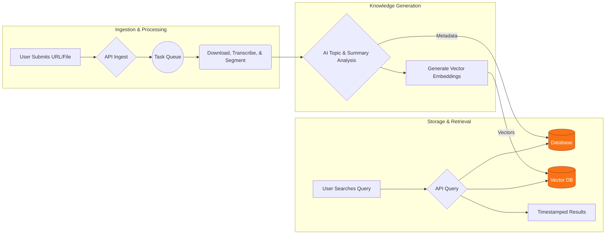

# Citeio

**Citeio is an intelligent media analysis platform that turns your long-form video and audio into a structured, searchable, and queryable knowledge base. Stop scrubbing through timelines—find the exact moment you need, instantly.**

 

<a href="[https://www.citeio.com](https://www.citeio.com)" target="\_blank"\>
<strong>► See It In Action: Visit the Live Platform at Citeio.com ◄</strong>
</a>

-----

## The Problem: Lost Knowledge in Long-Form Content

Valuable insights are buried in hours of podcasts, lectures, and interviews. Finding a specific topic means endless manual scrubbing, guessing timestamps, and wasting time. This "information overload" makes your media library a black box—full of content, but devoid of accessible knowledge.

## The Solution: Your Media, Instantly Intelligible

Citeio solves this by creating a "semantic index" of your content. It automatically processes media to understand *what* is being said and *when*. It identifies distinct topics, generates summaries, and allows you to search your entire library by concept or idea, not just by matching keywords.

-----

## ► Core Features

* **🎙️ Automated Ingestion & Transcription:**

  * Seamlessly ingest media from sources like YouTube or direct uploads.
  * Standardize all content into a high-quality audio format for optimal analysis.
  * Generate precise, time-coded transcripts for every piece of media.

* **🧠 AI-Powered Content Intelligence:**

  * Leverage advanced language models to automatically identify and segment distinct thematic topics within a single file.
  * Receive concise, AI-generated summaries for both the entire media file and for each individual topic.

* **🔍 Powerful Semantic Search:**

  * Go beyond keyword search. Find what you're looking for based on concepts and ideas.
  * Query your library with natural language (e.g., "when did they discuss market strategy?") and get back the exact, timestamped segment.

* **⚙️ Developer-First RESTful API:**

  * Integrate Citeio's capabilities into your own applications. A comprehensive API exposes all core functionalities, from ingestion to search.

-----

## ► How It Works: The Analysis Pipeline

The platform uses a sophisticated, automated pipeline designed for scalability and efficiency.

-----

## ► Usage & Pricing Plans

Citeio offers a range of plans to suit your needs, from trying out the platform to handling large-scale research projects.

| Plan       | Price | Analysis Credits   | Clips per Search | Credit Expiration |
| :--------- | :---: | :----------------: | :--------------: | :---------------: |
| **Free** | **$0** | 5                  | Up to 10         | 3 Days            |
| **Starter**| **$3** | 10                 | Up to 100        | 15 Days           |
| **Creative**| **$21** | 84                 | Up to 100        | 30 Days           |
| **Pro** | **$84** | 420                | Up to 100        | 60 Days           |

### Plan Details

* **Free:** Sign up for 5 free credits to try AI-powered YouTube video analysis. Explore our transcript library, organize research in folders, and use the new semantic search to retrieve up to 10 clips per query, pinpointing key moments. A perfect introduction.

* **Starter ($0.33 per credit):** Get 10 credits for AI video analysis, ideal for small projects. Access our full transcript library, organize your findings, and use semantic search to find up to 100 relevant clips per query. Uncover insights faster.

* **Creative ($0.25 per credit):** Power up with 84 credits for in-depth video analysis. Explore our extensive transcript library, organize your research, and leverage semantic search to retrieve up to 100 relevant clips per query for your creative projects.

* **Pro ($0.20 per credit):** Maximize your research with 420 credits for comprehensive video analysis. Dive deep into our transcript library, organize effectively, and utilize powerful semantic search to retrieve up to 100 relevant clips per query for your most demanding projects.

### Important Notes on Plans

For paid plans, purchasing a new plan of the same type while one is active will queue it. Credits from the new plan activate once the current plan's credits are depleted or expire. Different types of plans can be active simultaneously. Free plan credits are typically for new users.

-----

## ► Tech Stack

This project is built on a modern, robust, and scalable technology stack, leveraging Google's state-of-the-art AI infrastructure.

| Category   | Technologies                                               |
| :--------- | :--------------------------------------------------------- |
| **Frontend** | `Next.js`, `React`, `TypeScript`, `Tailwind CSS`           |
| **Backend** | `Python`, `FastAPI`, `Celery`, `Redis`                     |
| **AI / ML** | `Google Gemini`, `Google Text Embedding v4`                |
| **Database** | `MongoDB` (for metadata), `MongoDB Vector Search` (for vectors)      |
| **Deployment** | `Vercel` (Frontend), `Cloudflare Tunnel` (API), `Mac Mini` (Self-Hosted), `DigitalOcean` (BTCPay Server), `Docker` |

-----

## ► Project Status & Roadmap

**Current Status:** Citeio is **Live and Operational**. The core platform for media analysis and semantic search is stable and available at [Citeio.com](https://citeio.com).

**What's Next:** Our roadmap is focused on expanding data sources and deepening analytical capabilities.

* **🤖 Advanced Search & Interaction:**

  * **Chat with Media:** Go beyond search and engage in a conversation with your video content to ask follow-up questions and explore topics dynamically.
  * **Hybrid Search & Reranking:** Implement advanced search techniques combining keyword and semantic matching, with a reranking layer to deliver hyper-relevant results.
  * **Contextual Summaries:** Move from simple clip retrieval to providing AI-generated summaries and analysis based on the context of your search query.

* **🌐 Expanding Data Sources:**

  * **X (Twitter) Spaces:** Ingest and analyze live and recorded audio conversations from X Spaces.
  * **Vimeo Integration:** Broaden support for professional video content hosted on Vimeo.
  * **Direct User Uploads:** Allow users to securely upload their own private audio and video files for analysis.

## ► Proprietary Source Code

Please note that Citeio is a commercial product. The source code is proprietary and not available in this public repository. This repository serves as a professional showcase of the project's architecture, features, and vision.

## ► Contact & Inquiries

For business inquiries, enterprise licensing, or to request a private demo, please reach out.

**Indigo Nakamoto** - **[x.com/indigo\_nakamoto](https://x.com/indigo_nakamoto)**

Project Website: **[https://citeio.com](https://citeio.com)**
