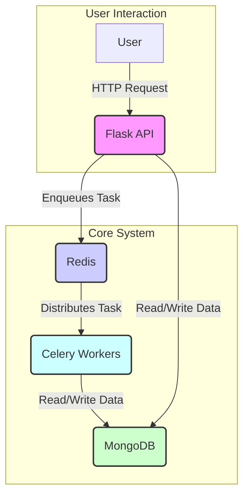

# Citeio

**An intelligent media analysis platform that transforms long-form video and audio content into a structured, searchable, and queryable knowledge base.**

 

  

---

## ► About The Project

Citeio is a full-stack application designed to ingest, analyze, and index media content. It tackles the problem of "information overload" in video and podcasts by automatically breaking down long-form content into distinct topics, summarizing them, and making the entire library semantically searchable. This allows users to find the exact moment a topic is discussed without scrubbing through hours of footage.

 

## ► Core Features

- **🎙️ Automated Media Ingestion & Transcription:**

  - Downloads media from external sources (e.g., YouTube).
  - Standardizes content to an optimal audio format.
  - Generates a detailed, time-coded transcript.

- **🧠 AI-Powered Content Analysis:**

  - Uses advanced language models to identify and extract distinct thematic topics.
  - Generates concise summaries for both the entire media file and each individual topic.

- **🔍 Powerful Semantic Search:**

  - Generates vector embeddings for all content, capturing its semantic meaning.
  - Allows users to search based on concepts and ideas, not just keywords, and get back precise, timestamped results.

- **⚙️ RESTful API:**
  - Exposes all functionality through a comprehensive API, allowing for easy integration with other services or client applications.

 

## ► Architecture & Workflow

The application follows a sophisticated, automated pipeline from media ingestion to final output. The architecture is designed for scalability and efficient processing.

 

## ► Tech Stack

This project leverages a modern, robust tech stack to handle its various components.

| Category       | Technologies                                                         |
| -------------- | -------------------------------------------------------------------- |
| **Frontend**   | `Next.js`, `React`, `TypeScript`, `Tailwind CSS`                     |
| **Backend**    | `Python`, `Flask`, `Celery`, `Redis`                                 |
| **AI / ML**    | `LangChain`, `OpenAI API`, `SentenceTransformers`                    |
| **Database**   | `MongoDB`                                                            |
| **Deployment** | `Docker`, `Vercel` (for Frontend), `Cloudflare Tunnel` (for Backend) |

 

---

## ► Note on Source Code

Please note that the source code for **Citeio** is proprietary and not available in this public repository. This project is under active development with the goal of commercialization.

This repository serves as a public showcase of its features, architecture, and technology stack.

## ► Contact & Inquiries

For business inquiries or to request a private demo, please feel free to reach out.

**Indigo Nakamoto** - [x@indigo_nakamoto](https://x.com/indigo_nakamoto)

Project Link: [https://github.com/IndigoNakamoto/citeio](https://github.com/IndigoNakamoto/citeio)
